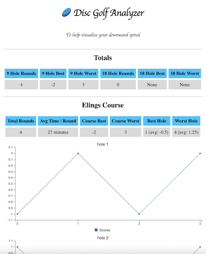

# 🥏 Disc Golf Analyzer

This is a very simple 🍦js app for connecting to the Strava api through oauth, getting disc golf activites, and trending data on games and "holes".

## ¡Requirements!

- Had no desire to build a back-end for something so simple, so you need ask me for a secret key @danielmcleod42@gmail.com
- You need a [Strava](https://www.strava.com) account
- Activity Convention: Strava doesn't have a disc golf activity type, so the following requirements are needed to properly pull info
    - Activity titles must be prefixed with [DG - Course Name]. Ex: "[DG - Elings] Rough Round"
    - If you want to track holes, add tuples of each hole in the description of your activity. Ex: (0, 1, -1, 0, 0, 1, 0, 0, 1)
    - If you play multiple rounds, you can comma separate the tuples. Ex: (0, 1, -1, 0, 0, 1, 0, 0, 1), (-1, 1, -1, 0, 2, 1, 0, 2, 1)

## Example Output

